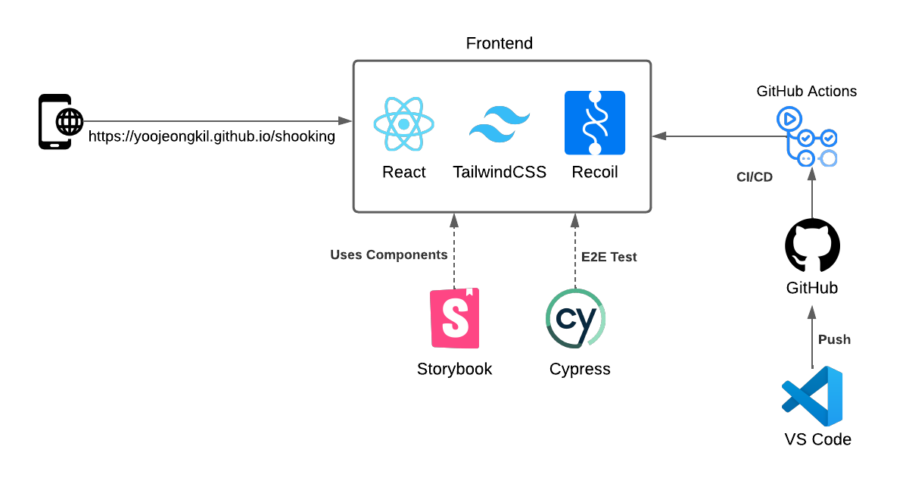

# 프로젝트 개요

## 프로젝트 소개

본 프로젝트는 사용자에게 편리하고 직관적인 온라인 신발 쇼핑 환경을 제공하기 위해 기획되었습니다. 상품 검색, 비교, 장바구니 관리, 결제 과정을 통합하여 사용자가 쉽게 구매할 수 있는 플랫폼을 구축하는 것을 목표로 합니다.

## 프로젝트 목표

1. 상품 목록: 고객에게 다양한 상품을 표시하고, 원하는 상품을 선택하여 장바구니에 추가할 수 있는 기능 제공.

2. 장바구니: 장바구니에 담긴 상품과 금액을 확인하고, 결제 단계로 진행할 수 있는 기능 제공.

3. 결제 모듈: 카드 등록과 결제를 지원하며 안전하고 간편한 결제 경험 제공.

## 프로젝트 배경

온라인 쇼핑 시장의 성장과 모바일 사용 증가로 인해, 사용자는 간편하고 직관적인 쇼핑 경험을 기대하고 있습니다. 기존 신발 쇼핑몰의 한계를 개선하고, 사용자 만족도를 높이는 효율적이고 신뢰성 있는 쇼핑몰 서비스를 구축하는 것이 본 프로젝트의 핵심 목표입니다.

## 해결하고자 하는 문제

- 다양한 상품 정보 탐색의 어려움: 많은 브랜드와 모델 중에서 원하는 상품을 쉽게 찾기 어려움

- 장바구니와 결제 과정의 복잡함: 상품 선택 후 결제까지의 과정이 직관적이지 않음

- 모바일 환경에서의 쇼핑 경험 불편: 모바일에서도 편리하게 쇼핑할 수 있는 UI/UX 필요

- 안전하고 간편한 결제 시스템 필요: 신뢰할 수 있는 결제 수단 제공 필요

# 시스템 아키텍처



1. Frontend (React + TailwindCSS + Recoil)

   - React: 사용자 인터페이스(UI) 개발

   - TailwindCSS: 반응형 및 일관된 스타일링 지원

   - Recoil: 전역 상태 관리 라이브러리

2. Testing (Storybook, Cypress)

   - Storybook: UI 컴포넌트 테스트 및 문서화

   - Cypress: 사용자 시나리오 기반 E2E(End-to-End) 테스트

3. CI/CD
   - GitHub Actions: 코드 푸시 시 자동 빌드, 테스트, 배포

# 개발 환경 설정 및 규칙

## 환경 설정

1. 필수 소프트웨어 설치

   - Node.js: v20 이상

   - npm 또는 yarn: 프로젝트 패키지 관리

   - Git: 버전 관리

   - IDE: VS Code 권장 (추천 플러그인: ESLint, Prettier)

2. 프로젝트 클론 및 의존성 설치

```
git clone https://github.com/YoojeongKil/shooking.git
cd shooking
npm install
```

## 코드 저장소 구조

```
/project-root
├─ docs/              # 프로젝트 문서
├─ shooking/          # 쇼핑몰 관련 소스 코드
│ ├─ storybook/       # Storybook 설정 및 컴포넌트 문서
│ ├─ cypress/         # E2E 테스트 관련
│ └─ src/             # 핵심 소스 코드
│   ├─ components/    # 재사용 가능한 UI 컴포넌트
│   ├─ context/       # React Context 관련 코드
│   ├─ data/          # 상품 데이터
│   ├─ images/        # 이미지 리소스
│   ├─ pages/         # 페이지 단위 컴포넌트
│   ├─ recoil/        # Recoil 상태 관리
│   ├─ utils/         # 유틸리티 함수
│   ├─ package.json   # 프로젝트 의존성 및 스크립트
│   └─ README.md      # 프로젝트 개요 및 설명
```

## 브랜치 전략

- `main`: 배포용 안정 브랜치

- `development`: 개발 통합 브랜치

- `feature/*`: 기능 개발 브랜치

- `fix`: 긴급 수정 브랜치

## 커밋 메시지 규칙

- 형식: `타입 : 설명`

- 타입 예시: feat (기능), fix (버그), docs (문서)

  - 예: `feat: 상품 목록 페이지`

# 프로젝트에서 중요했던 지점

1. Sprint 기반 개발 프로세스

   - 1~2주 단위 Sprint로 작업을 계획하고 진행, 우선순위가 높은 기능부터 구현하며 주기적 피드백 확보
   - 개발 속도 관리, 팀원 간 업무 조율과 협업 효율 향상

2. 기술 스택 선정 (React + TailwindCSS + Recoil)

   - 컴포넌트 기반 개발, 빠른 스타일링, 효율적인 상태 관리
   - 모듈 단위 개발 용이, 코드 재사용성과 유지보수성 향상

3. 컴포넌트 문서화 및 테스트 (Storybook + Cypress)

   - UI 일관성과 기능 안정성을 확보하고, 팀원 간 협업 효율 향상
   - 테스트와 문서화를 통해 기능 검증, 버그를 조기에 발견하여 개발 품질을 높임

4. GitHub Actions 기반 CI/CD 배포 자동화

   - 코드 병합 시 자동 빌드, 테스트, 배포를 수행하도록 CI/CD 파이프라인 구성
   - 배포 과정의 수동 오류 감소, 빠른 기능 배포 가능

# 다른 문서를 어떻게 참고하면 좋을지에 대한 가이드

## 문서 참고 방법

- 기존 문서를 먼저 읽고 충분히 이해합니다.

- 변경 사항은 기존 문서에 바로 적용하지 않고, 별도의 브랜치에서 작성합니다.

- 관련 문서는 `docs/` 폴더 내에서 확인할 수 있습니다.

## 문서 갱신 절차

1. 수정할 문서 확인

2. 브랜치 생성 후 내용 수정

3. PR 작성 → 리뷰 → 승인

4. 승인 후 main 브랜치 병합
